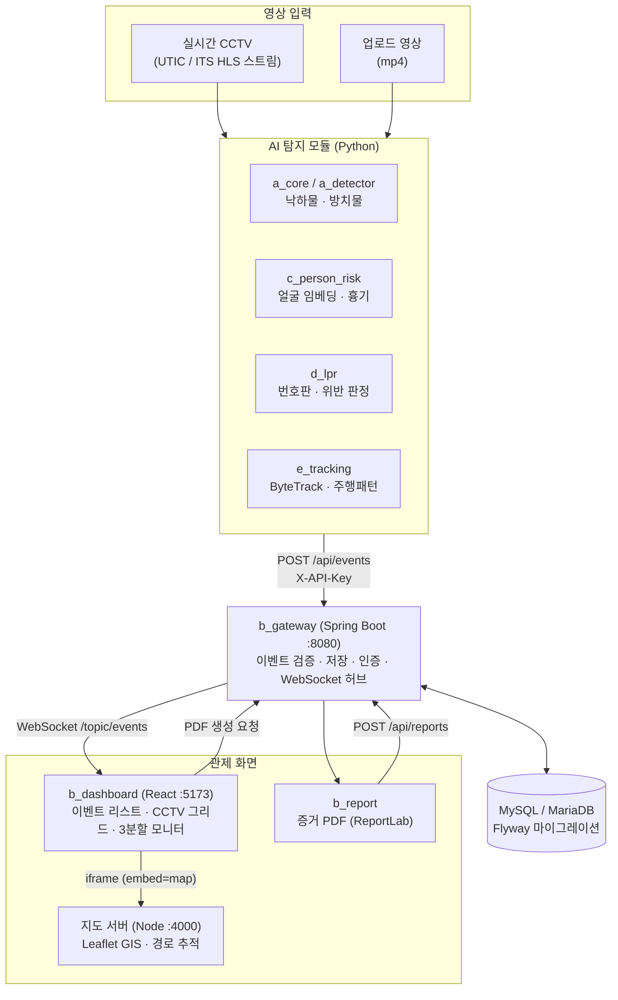

# Vigilog

**AI 기반 지능형 CCTV 통합 관제 시스템**

수배자·흉기·위험 차량·도로 낙하물을 실시간으로 자동 탐지하고, 관심 대상을 다중 CCTV로 추적하며, 사건 증거를 PDF로 자동 문서화합니다.

> 기존 지능형 CCTV가 **"탐지 후 알림"**에서 끝나는 것과 달리,
> 오메카3는 **탐지 → 실시간 관제 → GIS 추적 → 증거 PDF 발급**까지 대응 흐름 전체를 자동화합니다.

| | |
|---|---|
| **대상 고객** | 지자체 통합관제센터, 경찰청 등 공공기관 (B2G) |
| **형태** | 웹 기반 관제 서비스 (별도 설치형 클라이언트 없음) |
| **팀** | 5명 / 4주 스프린트 |
| **기능 범위** | 7종 이벤트 자동 탐지 + 통합 관제 대시보드 |

---

## 1. 왜 만드는가

전국 지자체 CCTV는 **2021년 47만 대 → 2024년 65만 대**로 늘었지만, 같은 기간 관제 인력은 **4,277명 → 4,093명**으로 오히려 줄었습니다.
관제요원 1인당 담당 대수는 행안부 권고 기준(50대)의 **약 10배**입니다.

- 사람의 집중력만으로 수십 대의 화면에서 이상 상황을 놓치지 않는 것은 물리적으로 불가능합니다.
- 사건이 발생한 뒤 증거 영상·캡처를 수동으로 정리하는 데도 상당한 시간이 듭니다.

**→ 탐지는 AI가, 판단과 대응은 사람이.** 관제요원이 "봐야 할 화면"만 자동으로 골라주고, 사후 증거 정리까지 자동화하는 것이 오메카3의 목표입니다.

---

## 2. 핵심 기능 7종

| # | 기능 | 이벤트 타입 | 담당 | 모듈 |
|:--:|------|------------|:----:|------|
| ① | 수배자 얼굴 인식 | `WANTED_PERSON` | 이시헌 | `c_person_risk/` |
| ① | 흉기 소지 탐지 | `WEAPON` | 이시헌 | `c_person_risk/` |
| ② | 사건 전후 증거 PDF 리포트 자동 생성 | *(전 이벤트 공통)* | 장성혁 | `b_report/` |
| ③ | 관심 대상 다중 CCTV 연계 추적 + GIS 경로 시각화 | *(추적 기능)* | 김준호 | `e_tracking/` |
| ④ | 미등록 차량(대포차·수배차) 실시간 감지 | `UNREGISTERED_VEHICLE` | 박지원 | `d_lpr/` |
| ⑤ | 도로 낙하물·방치물(공유 킥보드 등) 자동 감지 | `DEBRIS` | 김관용 | `a_core/`, `a_detector/` |
| ⑥ | 음주운전 의심 주행 패턴 감지 | `DUI_PATTERN` | 김준호 | `e_tracking/` |
| ⑦ | 불법 유턴 · 신호 위반 차량 감지 | `UTURN_VIOLATION`, `SIGNAL_VIOLATION` | 박지원 | `d_lpr/` |

7종 모두 **하나의 공통 이벤트 스키마**로 통일해 게이트웨이에 전송하므로, 저장·실시간 알림·증거 리포트 로직을 전 기능이 그대로 재사용합니다. (→ [6. 공통 이벤트 스키마](#6-공통-이벤트-스키마))

---

## 3. 시스템 구조



### 데이터 흐름 한 줄 요약

```
영상 → AI 탐지 → POST /api/events → DB 저장 → WebSocket 실시간 push
     → 대시보드 자동 포커싱 → GIS 경로 표시 → 증거 PDF 생성·등록
```

### 포트 구성

| 서비스 | 포트 | 기술 |
|---|:--:|---|
| `b_gateway` — API + DB + 실시간 허브 | `8080` | Spring Boot 3 / Java 21 |
| `b_dashboard` — 관제 화면 | `5173` | React 19 + Vite |
| 지도 서버 (`e_tracking/SmartCCTV/server`) | `4000` | Node.js (Express) |

---

## 4. 현재 진행 상황

> 기준일: 2026-08-22 · ✅ 동작 확인 / 🟡 구현 완료·통합 검증 중 / ⬜ 예정

### 공통 인프라 (모듈 B)

| 항목 | 상태 | 비고 |
|---|:--:|---|
| 이벤트 수신 API + DB 저장 (`POST /api/events`) | ✅ | 7종 이벤트 타입 검증 포함 |
| WebSocket 실시간 알림 (STOMP + SockJS) | ✅ | `/topic/events` |
| 인증 이원화 — 관제요원 JWT / 모듈 X-API-Key | ✅ | 회원가입 → 관리자 승인 플로우 포함 |
| Flyway DB 마이그레이션 (V1~V5) | ✅ | 서버 기동 시 스키마 자동 적용 |
| 카메라 관리 (등록·수정·영상 업로드·기능별 On/Off) | ✅ | 카메라별 낙하물/위반 감지 토글 |
| 실시간 CCTV 그리드 뷰 (HLS 재생, 6/9분할) | ✅ | `hls.js` |
| 3분할 멀티 모니터 모드 | ✅ | 관제센터 실사용 형태 |
| 관심 대상(Target) 등록·추적 종료 | ✅ | 차종/색상 포함 |
| 랜딩페이지 + 파일럿 신청 모달 | 🟡 | UI 완성, 저장 API는 방향 미정 |

### 기능별 진행 상황

| # | 기능 | 상태 | 현재까지 구현된 것 |
|:--:|---|:--:|---|
| ① | 수배자 얼굴 인식 | 🟡 | 얼굴 임베딩 DB 구축(`build_face_db.py`) + 유사도 매칭, FastAPI 라우터·이벤트 전송 구현 |
| ① | 흉기 탐지 | 🟡 | 학습 모델(`models/best.pt`) 확보, 탐지 로직 구현 — 통합 검증 진행 중 |
| ② | 증거 PDF 리포트 | ✅ | 대시보드 버튼 → 게이트웨이 → `b_report` 호출 → PDF 생성 → `POST /api/reports` 등록까지 연결 완료 |
| ③ | 다중 CCTV 추적 · GIS | ✅ | Leaflet 지도 + UTIC 실시간 CCTV 연동, 구간 이동 시연(Forza 데모), WebSocket 이벤트 실시간 표시 |
| ④ | 미등록 차량 감지 | ✅ | 번호판 검출 → 전처리·보정 → 인식 → `vehicle` 원장 대조 → 수배/대포차/미등록 판정 (테스트 241건) |
| ⑤ | 낙하물 · 방치물 감지 | ✅ | 파인튜닝 모델 `road_hazard.pt` (킥보드/라바콘/낙하물 3클래스) + 정지 지속시간 기반 판정 |
| ⑥ | 음주운전 의심 패턴 | ✅ | 궤적 기반 이상운전 탐지(`realtime_anomaly.py`) → 게이트웨이 전송 |
| ⑦ | 불법 유턴 · 신호 위반 | ✅ / 🟡 | 유턴: ROI 통과 방향·궤적 분석으로 검출 확인 / 신호위반: 신호 API 연동 구현, 실영상 검증 중 |

### 자동화 — 카메라 등록만 하면 감지가 붙습니다

`a_core/camera_watcher.py`가 게이트웨이를 주기적으로 폴링해서,
**"운영 중 + 해당 감지 기능 On + 영상 URL 있음"** 조건을 만족하는 카메라마다 탐지 프로세스를 자동으로 켜고 끕니다.

```
카메라 관리 화면에서 "낙하물 감지 사용" 체크
        ↓ (최대 2초)
watcher가 감지 → yolo_infer.py 자동 실행 → 이벤트 발생 시 대시보드에 실시간 표시
```

관제요원이 터미널을 만질 필요가 없도록 만든 부분이며, 불법유턴/신호위반(`run_uturn.py`)도 동일한 방식으로 연결됩니다.

### 남은 작업

- ⬜ ①(얼굴/흉기) 모듈의 실시간 파이프라인 통합 및 정확도 튜닝
- ⬜ 대시보드 PDF 버튼(클라이언트 캡처)과 `b_report`(정식 증거 리포트) 경로 일원화
- ⬜ 7종 이벤트 동시 발생 상황에서의 통합 부하 테스트
- ⬜ 발표용 시연 시나리오 정리

---

## 5. 빠른 시작

> 자세한 내용은 **[QUICKSTART.md](QUICKSTART.md)** 참고. DB는 직접 만들지 않습니다 — Flyway가 자동으로 생성합니다.

### 사전 준비물

| | 확인 명령 |
|---|---|
| MySQL 8 (서버만 켜져 있으면 됨) | `mysql --version` |
| Java 21 | `java -version` |
| Node.js 18+ | `node -v` |
| Python 3.11+ | `python --version` |

### 처음 한 번 (약 5분)

```powershell
# 1) 빌드
cd b_gateway;                   .\mvnw clean package -DskipTests;  cd ..
cd b_dashboard;                 npm install;                       cd ..
cd e_tracking\SmartCCTV\server; npm install;                       cd ..\..\..

# 2) 환경변수 — DB_PASSWORD 한 줄만 본인 값으로
copy b_gateway\.env.example b_gateway\.env
notepad b_gateway\.env
```

`.env`의 `GATEWAY_API_KEY` / `JWT_SECRET`은 **팀 전원이 같은 값**이어야 합니다(모듈 인증·토큰 검증이 이 값으로 이뤄짐).

### 실행

```powershell
.\start.ps1 -Run          # 서버 3개 + 감지 워처 기동 후 브라우저 자동 오픈
.\start.ps1               # 실행 없이 준비 상태만 점검
.\start.ps1 -Run -Mock    # 위에 더해 가짜 이벤트 10건까지 전송
```

브라우저: `http://localhost:5173` — 로그인 **`admin` / `admin1234`**

### 화면에 데이터 넣기

```powershell
# (a) 연결 확인용 가짜 이벤트
cd b_gateway
python scripts\mock_events.py --count 10 --interval 1

# (b) 실제 영상에서 번호판·위반 감지
cd d_lpr
python run_uturn.py --video videos\uturn_sample.mp4 --cam UTURN3 `
  --weights ..\e_tracking\SmartCCTV\yolo11m.pt `
  --lpr --gateway http://localhost:8080

# (c) 낙하물 감지 (영상 직접 지정)
python a_core\yolo_infer.py --video <파일 또는 URL>
```

먼저 (a)로 화면이 도는지 확인한 뒤 (b)·(c)를 돌리면, 문제가 생겼을 때 **연결 문제인지 모델 문제인지** 바로 갈립니다.

---

## 6. 공통 이벤트 스키마

전 모듈은 탐지 결과를 아래 규격으로 통일해 `POST /api/events`로 전송합니다.
필드 상세는 [`shared/schemas/이벤트_스키마_규격서.md`](shared/schemas/이벤트_스키마_규격서.md) 참고.

```json
{
  "camId": "CCTV-014",
  "trackId": "trk-1234",
  "eventType": "DEBRIS",
  "objectClass": "OBJECT",
  "bbox": [120, 80, 90, 140],
  "confidence": 0.912,
  "occurredAt": "2026-08-13T10:20:00.123Z",
  "location": { "lat": 37.5326, "lng": 127.0246 },
  "isRegisteredTarget": false,
  "targetId": null,
  "roiId": 3,
  "meta": {
    "detectedClass": "electric_scooter",
    "stationaryDurationSec": 12.4
  },
  "frameRefBefore": "captures/evt_before.jpg",
  "frameRefAfter": "captures/evt_after.jpg"
}
```

**설계 원칙 — "공통 필드 + `meta`" 구조**

기능마다 필요한 부가 정보가 다릅니다(얼굴은 `faceMatchScore`, 낙하물은 `stationaryDurationSec`, 음주운전은 `zigzagCount`…).
이를 전부 DB 컬럼으로 만들면 기능이 추가될 때마다 `ALTER TABLE`이 필요합니다.
그래서 **모든 이벤트가 공통으로 갖는 값만 고정 컬럼**으로 두고, 유형별로 다른 값은 **`meta` JSON 하나**에 담았습니다.
→ 새 이벤트 타입이 생겨도 API·DB 구조를 바꾸지 않아도 됩니다.

> 이벤트 스키마와 WebSocket 채널은 **모듈 B(장성혁)가 소유**합니다.
> 다른 모듈은 이를 소비만 하며, 최상위 필드를 임의로 추가하지 않고 `meta`로 확장합니다.

### DB 테이블

`camera` · `camera_catalog` · `target` · `roi` · `event` · `report` · `user` · `vehicle` · `plate_read_log`

설계 근거는 [`shared/schemas/DB_스키마_설계서.md`](shared/schemas/DB_스키마_설계서.md), 실제 DDL은 `b_gateway/src/main/resources/db/migration/`에 있습니다.

---

## 7. 프로젝트 구조

```
omecca_Project/
├── a_core/                 영상 입력 · YOLO 추론 실행 · 감지 자동화 워처   (김관용)
│   ├── yolo_infer.py           낙하물/흉기 탐지 + 이벤트 전송
│   ├── camera_watcher.py       카메라 등록 ↔ 감지 프로세스 자동 연결
│   └── schema.py               공통 이벤트 페이로드 생성
├── a_detector/             낙하물 모델 · 클래스 정의 · 학습 스크립트       (김관용)
│   ├── models/road_hazard.pt   파인튜닝 모델 (킥보드/라바콘/낙하물)
│   ├── hazard_classes.py       탐지 클래스 단일 진실 공급원
│   └── stationary_tracker.py   정지 지속시간 기반 방치물 판정
├── b_gateway/              Spring Boot API 게이트웨이 · 인증 · WebSocket  (장성혁)
│   └── src/main/resources/db/migration/   Flyway 마이그레이션 V1~V5
├── b_dashboard/            React 관제 대시보드                            (장성혁)
│   ├── src/components/         CCTV 그리드, 이벤트 리스트, 카메라 관리 …
│   └── src/pages/              랜딩 · 로그인 · 회원가입 · 관리자 승인
├── b_report/               증거 PDF 생성 (ReportLab)                      (장성혁)
├── c_person_risk/          얼굴 임베딩 매칭 · 흉기 판정                    (이시헌)
├── d_lpr/                  번호판 인식(LPR) · 차량 위반 감지               (박지원)
│   ├── app/lpr/                검출 → 전처리 → 분할 → 인식
│   ├── app/violation/          ROI · 궤적 · 신호 연동 위반 판정
│   └── tests/                  테스트 241건
├── e_tracking/SmartCCTV/   다중 CCTV 추적 · GIS 지도 · 주행 패턴 분석      (김준호)
│   ├── web/map.js              Leaflet 지도 · 실시간 이벤트 표시
│   ├── server/                 UTIC 프록시 · WebSocket 브로드캐스트
│   └── realtime_anomaly.py     이상 주행(음주운전 의심) 탐지
├── shared/schemas/         공통 이벤트 스키마 · DB 설계서
└── start.ps1               서버 3개 + 워처 통합 실행 스크립트
```

---

## 8. 기술 스택

| 영역 | 사용 기술 |
|---|---|
| **AI / 영상처리** | Python 3.11, YOLOv11 (Ultralytics), ByteTrack, OpenCV, 커스텀 번호판 인식기 |
| **백엔드** | Spring Boot 3 (Java 21), FastAPI, Node.js / Express |
| **실시간 통신** | WebSocket (STOMP + SockJS), HLS (`hls.js`) |
| **DB / 마이그레이션** | MySQL 8 / MariaDB, Flyway, PostGIS(경로 저장, 선택) |
| **프론트엔드** | React 19, Vite, Leaflet.js |
| **문서 생성** | ReportLab (PDF 증거 리포트) |
| **외부 연동** | UTIC · ITS 실시간 CCTV, 공공데이터포털 신호 API |
| **데이터셋** | Roboflow, AI Hub |

---

## 9. 팀 구성

| 이름 | 역할 | 담당 기능 | 담당 모듈 |
|---|---|---|---|
| **김관용** (팀장) | 영상 인식 코어 · 낙하물 감지 | ⑤ | `a_core/`, `a_detector/` |
| **박지원** (부팀장) | 번호판 인식 · 차량 위반 감지 | ④ ⑦ | `d_lpr/` |
| **장성혁** | 백엔드 게이트웨이 · 대시보드 · 증거 리포트 | ② | `b_gateway/`, `b_dashboard/`, `b_report/` |
| **이시헌** | 얼굴 인식 · 흉기 판정 | ① | `c_person_risk/` |
| **김준호** | 다중 CCTV 추적 · GIS · 주행 패턴 분석 | ③ ⑥ | `e_tracking/` |

---

## 10. 문서 안내

| 문서 | 내용 |
|---|---|
| [QUICKSTART.md](QUICKSTART.md) | 처음 받은 사람이 화면까지 보는 데 필요한 전부 |
| [C_실행가이드.md](C_실행가이드.md) | 모듈별 상세 실행 순서 · 환경변수 · 트러블슈팅 |
| [B_파일구조_설명서.md](B_파일구조_설명서.md) | `b_gateway` / `b_dashboard` / `b_report` 파일별 역할 |
| [오메카3_구현_설계이유_정리_0817.md](오메카3_구현_설계이유_정리_0817.md) | **"왜 그렇게 만들었는가"** — 주요 설계 결정의 근거 |
| [shared/schemas/이벤트_스키마_규격서.md](shared/schemas/이벤트_스키마_규격서.md) | 공통 이벤트 포맷 규격 |
| [shared/schemas/DB_스키마_설계서.md](shared/schemas/DB_스키마_설계서.md) | 테이블 구조 · 관계 · 설계 고려사항 |
| [d_lpr/README.md](d_lpr/README.md) · [d_lpr/INTEGRATION.md](d_lpr/INTEGRATION.md) | LPR/위반 감지 모듈 사용법 및 통합 주의사항 |

---

## 11. 데이터셋

- [Roboflow: kick_board](https://universe.roboflow.com/han-a5nvo/kick_board) — Format: YOLOv11
- AI Hub 차량 번호판 데이터셋 (`d_lpr/prep_aihub.py`로 전처리)
- 라벨 분포 확인: `python count.py`

> 실제 도로에서 촬영한 번호판 사진 등 **개인정보가 포함된 데이터는 저장소에 커밋하지 않습니다.**
> 자세한 금지 목록은 [`d_lpr/INTEGRATION.md`](d_lpr/INTEGRATION.md) 참고.

---

## 12. 개발 일정

4주 스프린트

| 주차 | 목표 | 상태 |
|:--:|---|:--:|
| 1주차 | 환경 세팅 · 기본 탐지 모델 확보 | ✅ |
| 2주차 | 추적 · DB 연동 · 게이트웨이 통합 | ✅ |
| 3주차 | 증거 리포트 · GIS · 실시간 CCTV 연동 | ✅ |
| 4주차 | 통합 테스트 · 정확도 튜닝 · 발표 준비 | 🟡 진행 중 |