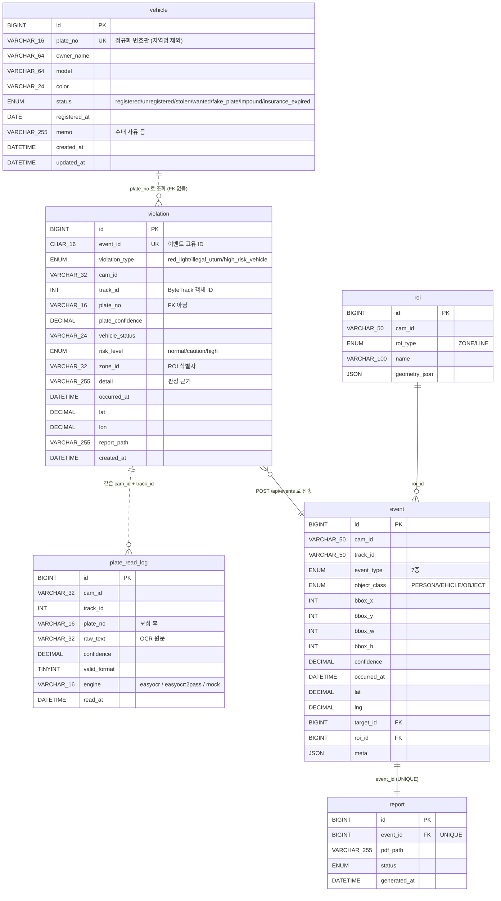

# d_lpr ERD — 번호판 인식 / 차량 위반 감지

담당: 박지원 · 개발 내용 ④·⑦
기준: `sql/schema.sql` (내 테이블) + `shared/schemas/DB_스키마_설계서.md` (팀 공통)

---

## 1. 관계도



---

## 2. 내 테이블 3개

### 2.1 `vehicle` — 차량 원장

**④번 기능의 판단 기준**이 되는 테이블. 인식한 번호판을 여기와 대조해
대포차·수배·도난·미등록을 판별한다.

| 컬럼 | 타입 | 설명 |
|---|---|---|
| `id` | BIGINT PK | 자동증가 |
| `plate_no` | VARCHAR(16) **UNIQUE** | **정규화 번호판** — 지역명 제외 (`서울12가3456` → `12가3456`) |
| `owner_name` | VARCHAR(64) | 소유자 |
| `model` / `color` | VARCHAR | 차종 / 색상 |
| `status` | ENUM 7종 | 아래 참고 |
| `registered_at` | DATE | 등록일 |
| `memo` | VARCHAR(255) | 수배 사유 등 |

**`status` 값과 위험도**

| status | 의미 | risk_level | 경보 |
|---|---|---|---|
| `registered` | 정상 등록 | normal | — |
| `insurance_expired` | 책임보험 만료 | caution | — |
| `impound` | 과태료 체납 영치 | caution | — |
| `fake_plate` | 대포차 (명의 불일치) | **high** | ✔ |
| `stolen` | 도난 신고 | **high** | ✔ |
| `wanted` | 수배 차량 | **high** | ✔ |
| `unregistered` | DB 미등록 *(레코드 없음)* | **high** | ✔ |

> `unregistered` 는 테이블에 저장되는 값이 아니라 **조회 실패 시 부여**되는 상태다.

### 2.2 `violation` — 위반 이벤트

⑦번(신호위반·불법유턴)과 ④번(고위험 차량) 이벤트를 모두 저장한다.

| 컬럼 | 설명 |
|---|---|
| `event_id` | CHAR(16) UNIQUE — 게이트웨이 `meta.eventId` 와 같은 값 |
| `violation_type` | `red_light` / `illegal_uturn` / `high_risk_vehicle` |
| `track_id` | ByteTrack(김준호) 이 부여한 객체 ID |
| `plate_no` | 인식된 번호판 |
| `zone_id` | 판정에 쓰인 ROI/가상 라인 식별자 |
| `detail` | 판정 근거 문장 (예: "적색 신호 중 정지선 통과 후 교차로 진출") |
| `lat` / `lon` | 카메라 GPS 좌표 |

### 2.3 `plate_read_log` — 인식 로그

**튜닝·분석 전용.** 인식이 왜 틀렸는지 추적하려고 남긴다.

| 컬럼 | 설명 |
|---|---|
| `raw_text` | OCR 원문 (보정 전) |
| `plate_no` | 포맷 보정 후 |
| `valid_format` | 한국형 번호판 규격 통과 여부 |
| `engine` | `easyocr` / `easyocr:2pass` / `mock` |

---

## 3. 설계 판단 3가지

### 3.1 `violation.plate_no` 에 FK 를 걸지 않았다

**미등록 차량 감지가 ④번의 핵심 기능**이다. FK 를 걸면 원장에 없는 번호판을
저장할 수 없어 정작 잡아야 할 대상을 기록하지 못한다.
조회 성능을 위해 인덱스만 걸었다.

```sql
KEY idx_violation_plate (plate_no)   -- FK 아님
```

### 3.2 `plate_no` 는 지역명을 뗀 정규화 형태로 저장

`서울12가3456` 과 `12가3456` 은 같은 차량이다. 저장·조회 모두
`pf.canonical()` 로 정규화해 통일한다. 그래야 UNIQUE 제약이 의미를 갖는다.

### 3.3 `plate_read_log` 는 30일 보관 전제

번호판은 개인정보보호법상 개인정보다. 인식률 튜닝 목적으로만 쓰고
보관 기간을 제한한다.

---

## 4. 팀 공통 테이블과의 관계

내 `violation` 은 **로컬 기록**이고, 팀의 `event` 가 **중앙 테이블**이다.
같은 이벤트가 양쪽에 남는다.

```
내 모듈 감지
   ↓
violation 테이블 저장 (로컬)
   ↓
app/core/gateway.py 가 규격 변환
   ↓
POST /api/events  →  event 테이블 (장성혁)
                       ↓
                     report (증거 PDF)
```

### 필드 대응표

| 내 `violation` | 팀 `event` | 변환 |
|---|---|---|
| `cam_id` | `cam_id` | 그대로 |
| `track_id` INT | `track_id` VARCHAR | `101` → `"trk-101"` |
| `violation_type` | `event_type` | `red_light` → `SIGNAL_VIOLATION` |
| | | `illegal_uturn` → `UTURN_VIOLATION` |
| | | `high_risk_vehicle` → `UNREGISTERED_VEHICLE` |
| — | `object_class` | 항상 `VEHICLE` |
| `occurred_at` | `occurred_at` | 유닉스 초 → ISO 8601 |
| `lat` / `lon` | `lat` / `lng` | 컬럼명 주의 (`lon` ≠ `lng`) |
| `zone_id` VARCHAR | `roi_id` BIGINT | 숫자만 추출, 원본은 `meta.roiName` |
| `plate_no` | `meta.plateNumber` | JSON 안으로 |
| `risk_level` | `meta.riskLevel` | JSON 안으로 |
| `vehicle_status` | `meta.vehicleStatus` | JSON 안으로 |
| `detail` | `meta.detail` | JSON 안으로 |
| `event_id` | `meta.eventId` | 서버 PK 와 별개 |
| `report_path` | `report.pdf_path` | 별도 테이블 |

변환은 `app/core/gateway.py` 가 자동으로 한다. 검증 테스트 22건.

---

## 5. 팀에 확인이 필요한 것 ★

**팀 DB 설계서에 차량 원장 테이블이 없습니다.**

`target` 테이블에 `plate_number` 컬럼이 있지만 이건 *관제요원이 등록한 관심 대상*이지
**차량 원장이 아닙니다.** 대포차·수배차 판별에는 전체 차량 DB 가 필요합니다.

| | `target` (팀) | `vehicle` (내 것) |
|---|---|---|
| 목적 | 관제요원이 추적 등록한 대상 | 전체 차량 원장 |
| 규모 | 수십~수백 건 | 수만~수백만 건 |
| 등록 주체 | 관제요원 수동 | 경찰청 DB 연계 |
| 용도 | "이 차 추적해줘" | "이 번호판이 수배차인가?" |

**두 가지 중 하나로 정해야 합니다.**

1. **`vehicle` 을 공통 테이블로 승격** — `shared/schemas` 에 추가하고 b_gateway 가 관리
2. **d_lpr 로컬 유지** — 지금 방식. 내 모듈이 자체 DB 로 판별하고 결과만 이벤트로 전송

지금은 **2번**으로 구현되어 있고 동작에 문제는 없습니다. 다만 나중에 다른 모듈도
차량 조회가 필요해지면 1번으로 옮기는 게 맞습니다. 장성혁 님과 상의가 필요합니다.

---

## 6. 실행

```bash
mysql -u root -p < sql/schema.sql   # 테이블 생성
mysql -u root -p < sql/seed.sql     # Mock 차량 12대
```

로컬 개발은 SQLite 로 자동 폴백된다 (`config.yaml` → `db.driver: sqlite`).
